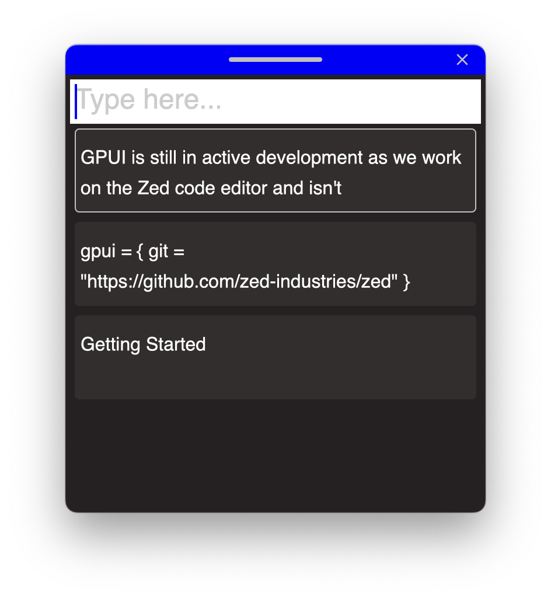

# clipboard

Created with Create GPUI App.

- [`gpui`](https://www.gpui.rs/)
- [GPUI documentation](https://github.com/zed-industries/zed/tree/main/crates/gpui/docs)
- [GPUI examples](https://github.com/zed-industries/zed/tree/main/crates/gpui/examples)

## Screenshot

## Usage

- Ensure Rust is installed - [Rustup](https://rustup.rs/)
- Run your app with `cargo run`
